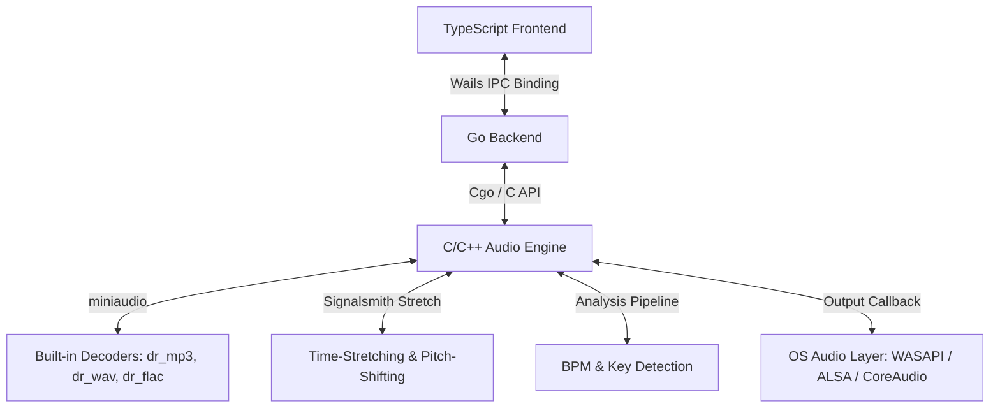

# 0xSoundPlayer Architecture & Design Specification

## 1. System Architecture Diagram



---

## 2. Technical Stack Details

### 2.1 Backend Core (Go)
*   **Wails v2**: Bridge between Go backend and TypeScript frontend.
*   **Cgo**: Low-latency communication layer with the C++ audio engine.

### 2.2 Audio Engine (C / C++)
*   **miniaudio.h**: Core engine for low-level audio I/O. Supports MP3, WAV, and FLAC natively through embedded decoders `dr_mp3`, `dr_wav`, and `dr_flac`. This eliminates the need for external codecs, binary downloads, or dynamic library loaders.
*   **Signalsmith Stretch**: Modern C++11 header-only DSP library for high-quality Pitch Shifting and Time-Stretching (tempo adjustments without pitch modification).
*   **Custom DSP**: Real-time DSP routines for Key and BPM analysis, including FFT and autocorrelation.

### 2.3 Frontend UI (TypeScript)
*   **HTML5 Canvas**: Waveform rendering using pre-computed peak arrays.
*   **React + CSS**: Premium dark-mode interface styled like desktop Spotify, compliant with the **UI/UX Pro Max** design guidelines.

---

## 3. Data Flow & Processing Pipeline

### 3.1 Audio Analysis Pipeline
When a local file is added to the library:
1.  **Decoding**: The file is parsed via miniaudio's decoder to extract PCM data.
2.  **Peak Calculation**: High-resolution waveform peaks are extracted by calculating Root-Mean-Square (RMS) values of blocks.
3.  **BPM Detection**: Downsample the envelope of the track's middle 30 seconds to 200Hz, and run an autocorrelation to find the lag with the highest peak in the 60-180 BPM range.
4.  **Key Detection**: 
    *   The PCM stream is windowed (Hanning) and processed via FFT.
    *   Frequencies are mapped to a 12-dimensional chroma vector (pitch classes).
    *   The chroma vector is correlated with Krumhansl-Schmuckler profiles for 24 musical keys.
    *   The output is mapped to Camelot Wheel codes (e.g., 8A for A minor, 8B for C major).

### 3.2 Mixing and Transition Engine (Smart Harmonic Transitions)
When "Auto-Mix" is enabled and Track A (slot 0) transitions to Track B (slot 1):
1.  **Beat-Aligned Start**: The transition is triggered exactly on a musical bar boundary close to the end of Track A. The actual crossfade duration is calculated dynamically to span an integer number of bars (e.g. 16 beats / 4 bars) based on Track A's BPM:
    $$T_{\text{fade}} = \text{round}\left(\frac{C \cdot \text{BPM}_A}{240.0}\right) \cdot \frac{240.0}{\text{BPM}_A}$$
    where $C$ is the target crossfade duration (default 8s).
2.  **Dynamic BPM Sync**: Rather than a static rate shift, the tempo of the outgoing Track A is continuously and smoothly ramped to meet the native tempo of the incoming Track B over the transition:
    $$\text{tempo\_ratio}_A(t) = 1.0 \cdot (1 - t) + \frac{\text{BPM}_B}{\text{BPM}_A} \cdot t$$
    where $t = \frac{\text{elapsed}}{T_{\text{fade}}} \in [0, 1]$. The incoming Track B starts playing immediately at its native tempo:
    $$\text{tempo\_ratio}_B(t) = 1.0$$
3.  **Pitch Invariance**: The pitch/key signature of both tracks is kept strictly invariant ($\text{pitch\_semi} = 0.0$ at all times) to preserve their original musical keys.
4.  **Equal-Power Crossfade**: An equal-power crossfade is performed to prevent dips in volume in the middle of the transition:
    $$\text{vol}_A(t) = \cos\left(t \cdot \frac{\pi}{2}\right), \quad \text{vol}_B(t) = \sin\left(t \cdot \frac{\pi}{2}\right)$$

### 3.3 Music Directory Synchronization
*   The application creates and manages a folder `.0xplayer` under the user's home directory (`~/.0xplayer`).
*   On startup or request, Go recursively scans this folder for `.mp3`, `.wav`, and `.flac` files, calls the C++ analyzer on any new tracks, and compiles a playlist table.
*   Users can launch the native file browser (Windows Explorer, Finder, or xdg-open) directly from the player interface to drop music files.

---

## 4. State Management & Interaction Fixes

### 4.1 Track Seek / Progress Slider Freezing
*   **Problem**: Dragging or clicking the track seek/progress slider caused the slider to freeze permanently at the clicked position, even though the backend successfully performed the track seek. This also kept the slider frozen when playing subsequent tracks.
*   **Root Cause**: 
    1. A race condition occurred between React's asynchronous state update (`setDragPosition`) and the synchronous DOM `mouseup`/`touchend` events. When `onChange` triggered a state update, React scheduled a re-render. If `onMouseUp` executed before the re-render finished, the handler read `dragPosition` as `null` from the previous render, skipping the seek finalization.
    2. If the user dragged the mouse outside the slider boundaries and released, the local `onMouseUp` event on the slider input element never fired at all, leaving `dragPosition` in a non-null state.
*   **Solution**:
    1. Added `dragPositionRef` (`useRef`) to store the temporary drag position synchronously.
    2. Added global `window` event listeners for `mouseup` and `touchend` when dragging is active, ensuring release events are captured anywhere on the screen.
    3. The global release handler reads from `dragPositionRef.current` synchronously to perform `Seek` and resets `dragPosition` back to `null`.

---

## 5. API Schema & Interface Definitions

### 5.1 Go to Frontend Wails Bindings
```go
package main

type TrackMetadata struct {
	FilePath     string    `json:"filePath"`
	DurationSec  float64   `json:"durationSec"`
	BPM          float64   `json:"bpm"`
	KeySignature string    `json:"keySignature"`
	Waveform     []float32 `json:"waveform"`
	Artist       string    `json:"artist"`
	Genre        string    `json:"genre"`
}

type SoundCloudResult struct {
	Title    string  `json:"title"`
	Uploader string  `json:"uploader"`
	URL      string  `json:"url"`
	Duration float64 `json:"duration"`
}

type Playlist struct {
	Name       string   `json:"name"`
	TrackPaths []string `json:"trackPaths"`
}

type App struct {}

func (a *App) LoadTrack(slot int, filePath string) (TrackMetadata, error)
func (a *App) Play(slot int)
func (a *App) Pause(slot int)
func (a *App) Seek(slot int, positionSec float64)
func (a *App) SetVolume(slot int, volume float64)
func (a *App) SetTempo(slot int, tempoRatio float64)
func (a *App) SetPitch(slot int, pitchSemi float64)
func (a *App) GetPosition(slot int) float64
func (a *App) IsPlaying(slot int) bool
func (a *App) ToggleAutoMix(enabled bool)
func (a *App) SetCrossfadeDuration(durationSec float64)
func (a *App) SelectAudioFile() (string, error)
func (a *App) GetMusicDir() (string, error)
func (a *App) ScanMusicDir() ([]TrackMetadata, error)
func (a *App) OpenMusicDir()
func (a *App) GetPlaylists() ([]Playlist, error)
func (a *App) SavePlaylists(playlists []Playlist) error
func (a *App) CreatePlaylist(name string) error
func (a *App) DeletePlaylist(name string) error
func (a *App) AddTrackToPlaylist(playlistName string, trackPath string) error
func (a *App) RemoveTrackFromPlaylist(playlistName string, trackPath string) error
func (a *App) SearchSoundCloud(query string) ([]SoundCloudResult, error)
func (a *App) DownloadFromSoundCloud(trackURL string) error
```

### 5.2 Real-Time IPC Events (Broadcasting)

The Go backend broadcasts real-time DSP event packets to the React frontend at ~60 FPS when tracks are active.

#### `spectrum`
*   **Payload Type**: `map[string][]float32` (JSON: `{"deck0": [...], "deck1": [...]}`)
*   **Description**: Concurrently calculated FFT spectrum bins (64 bins per deck, frequency range 0 - 22,050Hz).
*   **Go Broadcast Routine**:
    ```go
    wailsRuntime.EventsEmit(a.ctx, "spectrum", map[string][]float32{
        "deck0": spec0,
        "deck1": spec1,
    })
    ```
*   **React Frontend Subscription**:
    ```javascript
    import { EventsOn } from "../wailsjs/runtime/runtime";

    useEffect(() => {
        const unsubscribe = EventsOn("spectrum", (data) => {
            drawSpectrum(canvas0, data.deck0, 0);
            drawSpectrum(canvas1, data.deck1, 1);
        });
        return () => unsubscribe();
    }, []);
    ```

#### Examples of API Usage:
```javascript
// Load and scan user music directory
const dir = await App.GetMusicDir();
const tracks = await App.ScanMusicDir();
console.log(`Directory: ${dir}, Found ${tracks.length} files.`);

// Play a selected track
await App.LoadTrack(0, tracks[0].filePath);
await App.Play(0);

// Adjust mixing settings
await App.ToggleAutoMix(true);
await App.SetCrossfadeDuration(10.0);

// Playlist Management
const playlists = await App.GetPlaylists();
await App.CreatePlaylist("Chill Beats");
await App.AddTrackToPlaylist("Chill Beats", tracks[0].filePath);
await App.RemoveTrackFromPlaylist("Chill Beats", tracks[0].filePath);
await App.DeletePlaylist("Chill Beats");

// SoundCloud Integration
const results = await App.SearchSoundCloud("lofi study");
console.log(`Found ${results.length} results on SoundCloud.`);
if (results.length > 0) {
    // Download first track to ~/.0xplayer/soundcloud/
    await App.DownloadFromSoundCloud(results[0].url);
}
```