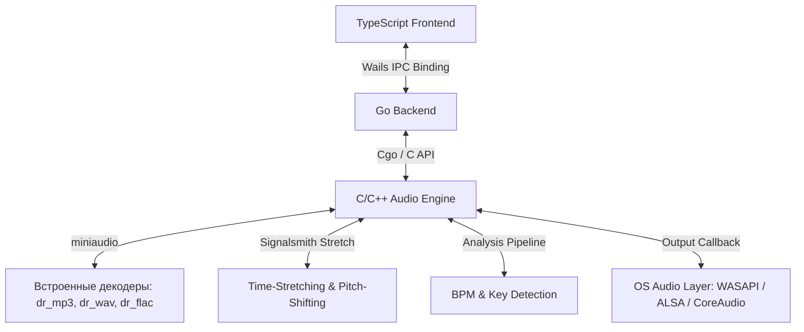

# 0xSoundPlayer 🎧

Высокопроизводительный настольный аудиоплеер с автоматическим умным гармоническим сведением, динамической синхронизацией темпа (BPM) и встроенным DSP-анализом аудиопотока. Построен на базе Go, C++11 и React/TypeScript с использованием фреймворка Wails.

---

## 🏗 Архитектура системы



---

## 🚀 Ключевые возможности

### 1. Полная автономность (Zero External Dependencies)
Аудиодвижок полностью построен на низкоуровневой библиотеке `miniaudio.h` со встроенными компилируемыми декодерами `dr_mp3`, `dr_wav` и `dr_flac`. Приложению не требуются внешние системные кодеки, сторонние бинарные утилиты или динамические библиотеки (`.dll` / `.so`) для базового декодирования и воспроизведения аудио.

### 2. Продвинутый конвейер DSP-анализа (Audio Analysis Pipeline)
При добавлении локальных треков в библиотеку автоматически запускается анализатор аудиопотока:
*   **Расчет формы волны**: Вычисляются среднеквадратичные значения (RMS) блоков сэмплов для построения высокоточного графика пиков на HTML5 Canvas.
*   **Детекция BPM**: Изолируется репрезентативный 30-секундный фрагмент аудио, огибающая сигнала даунсэмплится до 200 Гц, после чего применяется алгоритм автокорреляции для определения темпа в диапазоне 60–180 BPM.
*   **Определение тональности (Key Detection)**:
    *   Аудиосигнал обрабатывается оконной функцией Ханнинга (*Hanning window*) и подается на быстрое преобразование Фурье (*FFT*).
    *   Частоты проецируются на 12-мерный вектор хрома-признаков (*pitch classes*).
    *   Вектор коррелирует с тональными профилями Крамхансла-Шмуклера для 24 музыкальных ключей.
    *   Результат мапится в коды колеса Камелот (*Camelot Wheel*), например: **8A** (Ля-минор), **8B** (До-мажор).

### 3. Умный движок гармонических переходов (Smart Automix)
При активации функции Auto-Mix переход от уходящего трека (Track A / слот 0) к входящему треку (Track B / слот 1) полностью автоматизирован низкоуровневым C++ кодом:
*   **Сведение по сетке (Beat-Aligned Start)**: Переход активируется на границе музыкального такта ближе к концу трека. Длина кроссфейда динамически подстраивается под текущий темп трека А, чтобы занимать ровное целое число музыкальных тактов (например, 16 ударов / 4 такта):
    $$T_{\text{fade}} = \text{round}\left(\frac{C \cdot \text{BPM}_A}{240.0}\right) \cdot \frac{240.0}{\text{BPM}_A}$$
*   **Динамический BPM-синк (Dynamic BPM Sync)**: Темпы обоих треков непрерывно и плавно синхронизируются на протяжении всего времени кроссфейда от значения $\text{BPM}_A$ до $\text{BPM}_B$:
    $$\text{BPM}(t) = \text{BPM}_A \cdot (1 - t) + \text{BPM}_B \cdot t$$
    Коэффициенты растяжения времени (*tempo ratio*) пересчитываются «на лету» внутри общего аудиоколбэка для обеспечения непрерывности фазы.
*   **Гармоническая подстройка тональности (Harmonic Key Match)**: Плеер считывает текущую тональность трека А (с учетом его текущего питча) и автоматически подстраивает частоту (*Pitch-Shift*) входящего трека Б с помощью фазового вокодера *Signalsmith Stretch* к ближайшей совместимой тональности по колесу Камелот. Величина сдвига аппаратно ограничена диапазоном $\pm 2$ полутона, исключая появление слышимых звуковых артефактов.
*   **Равномощный кроссфейд (Equal-Power Crossfade)**: Математические нелинейные тригонометрические кривые косинуса и синуса предотвращают падение звукового давления и просадки громкости в середине микса:
    $$\text{vol}_A(t) = \cos\left(t \cdot \frac{\pi}{2}\right), \quad \text{vol}_B(t) = \sin\left(t \cdot \frac{\pi}{2}\right)$$

### 4. Синхронизация медиатеки и кэширование
*   Приложение сканирует директорию `~/.0xplayer` на наличие файлов `.mp3`, `.wav`, `.flac`.
*   Результаты DSP-анализа кэшируются в `cache.json`, защищая систему от повторной утилизации процессора при перезапуске.
*   Чтение метаданных ID3 и аудио-тегов (Исполнитель, Жанр) осуществляется средствами библиотеки [github.com/dhowden/tag](https://github.com/dhowden/tag).

### 5. Интеграция с SoundCloud
*   Локальный асинхронный поиск по ключевым словам через мост к консольной утилите `yt-dlp`.
*   Фоновое скачивание треков напрямую в `~/.0xplayer/soundcloud/` с автоматическим извлечением аудиопотока в MP3 высокой точности и внедрением обложек и метаданных.

---

## 🛠 Технологический стек

*   **Backend Layer**: Go 1.21+ (использование Wails v2 для организации IPC-биндингов и событийного рантайма).
*   **Audio Engine Core**: C++11 / Cgo. Низкоуровневый аудиовывод и управление буфером через `miniaudio.h`.
*   **Time-Domain DSP**: Header-only библиотека `Signalsmith Stretch` (высококачественный фазовый вокодер для растяжения времени без изменения питча).
*   **Frontend UI**: React, TypeScript, HTML5 Canvas для рендеринга спектра частот и сетки пиков с высокой частотой обновления.

---

## 🚀 Быстрый запуск

### Требования для локальной сборки
*   **Go** (v1.21 или новее)
*   **Node.js** (актуальная LTS-версия)
*   **yt-dlp** (должен быть установлен и прописан в переменные окружения `PATH` системы)
*   **C++ Компилятор (GCC/G++)**:
    *   **Windows**: Достаточно настроить MSYS2 (установить пакет `mingw-w64-x86_64-gcc`)
    *   **macOS**: Инструменты командной строки Xcode (`xcode-select --install`)
    *   **Linux**: Пакеты `build-essential` и `libasound2-dev`

### Инструкции по разработке

```bash
# Установка интерфейса Wails CLI (при отсутствии в системе)
go install github.com/wailsapp/wails/v2/cmd/wails@latest

# Запуск проекта в режиме живой разработки (Hot-reload для Go и Vite-сервера)
wails dev
```

### Сборка исполняемого файла

```bash
# Компиляция оптимизированного standalone бинарника под целевую систему Windows
wails build -platform windows/amd64
```

---

## 🤖 Автоматический CI/CD релиз

В репозитории развернут автоматический конвейер сборки GitHub Actions ([.github/workflows/release.yml](file:///.github/workflows/release.yml)). Любой пуш изменений или слияние веток в `main` инициирует автоматический разбор истории изменений по стандарту *Conventional Commits*:
*   **Фиксы** (`fix:`) автоматически поднимают патч-версию тега.
*   **Фичи** (`feat:`) автоматически поднимают минорную версию тега.

Рабочий процесс запускает виртуальную машину Windows, разворачивает окружение компилятора MSYS2, собирает и статически линкует Cgo аудиокомпоненты, выполняет минификацию ресурсов фронтенда и генерирует релиз на GitHub с прикрепленным готовым к запуску архивом `soundplayer-windows-amd64.zip`.
